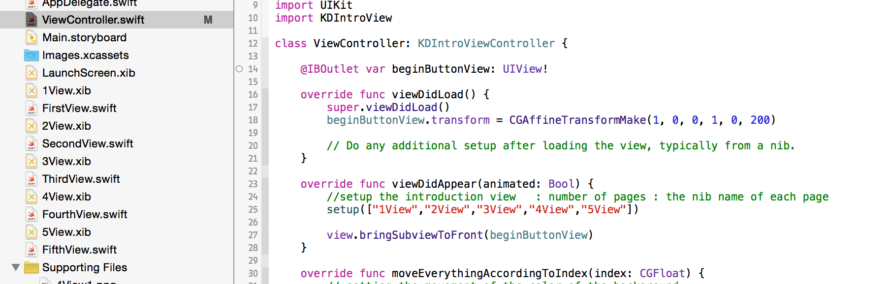
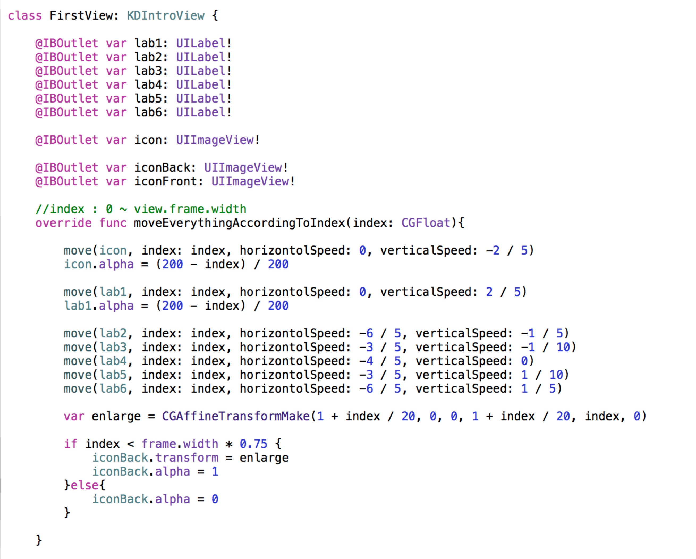

# KDIntroView


## Installation

To install
it, simply add the following line to your Podfile:

```ruby
pod 'KDIntroView'
```
or drag these files into the project

```ruby
KDIntroView.swift
KDIntroViewController.swift
```
To run the example project, clone the repo, and run `pod install` from the Example directory first.

## Requirements
iOS 8.0

## Introduction
`KDIntroView` is a framework to create dynamic introduction views for App. You can create all sorts of cool animations.

## Start!!!

- Step One


Create all the views you need as xibs. Link each xib file with a class that inherits `KDIntroView`. Override ` moveEverythingAccordingToIndex(index: CGFloat)`.


Design your interface as you wish. This framework works for both code generated UI and autolayout.

Make sure each view has a clear background color if you wish to perform color change.


- Step Two



Create a ViewController that inherits `KDIntroViewController`. (don't forget to import KDIntroView)


In `viewDidAppear`, call `setup`, and pass in an array that contains the name of all the xibs you created. Arrange them in the order you with them to appear. Override ` moveEverythingAccordingToIndex(index: CGFloat)`.

Now, you can see your views, but they are static.


- Step Three



Implement the `moveEverythingAccordingToIndex(index: CGFloat)` in each view. The `index: CGFloat` variable is the offset of the scroller. In the first and the last view, `index: CGFloat` range from 0 ~ frame.width. In all the other views, `index: CGFloat` range from 0 ~ 2 * frame.width.


We have build-in functions, but you can easily customize your animation with `CGAffineTransformation`. There are more example in the demo project.

Also implement the `moveEverythingAccordingToIndex(index: CGFloat)` in viewcontroller to perform color animation and touchable elements. All the touchable elements must be added in the view controller and call `view.bringSubviewToFront()` after `setup` to make them reachable.

You can literally create any kind of animation! Play around with it, and free your imagination!

## Author

Kedan Li, TakefiveInteractive.com

## License

KDIntroView is available under the MIT license. See the LICENSE file for more info.

